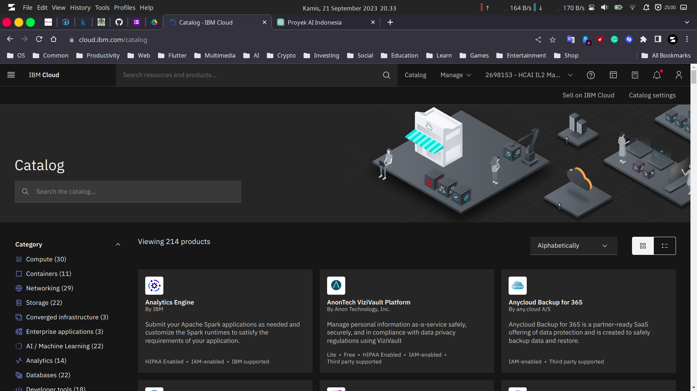
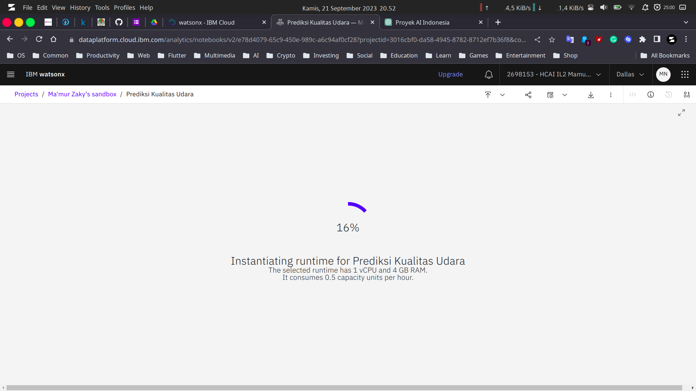

# Prediksi Kualitas Udara di Indonesia dengan Algoritma Support Vector Machine

oleh Ma'mur Zaky Nurrokhman

Repositori ini digunakan untuk mengerjakan dan menyimpan hasil capstone project di program Studi Independen Bersertifikat (SIB) di Infinite Learning.

## Daftar Isi

- [Prediksi Kualitas Udara di Indonesia dengan Algoritma Support Vector Machine](#prediksi-kualitas-udara-di-indonesia-dengan-algoritma-support-vector-machine)
  - [Daftar Isi](#daftar-isi)
  - [Latar Belakang](#latar-belakang)
  - [Tujuan](#tujuan)
  - [Langkah-langkah Pengerjaan Capstone Project](#langkah-langkah-pengerjaan-capstone-project)

## Latar Belakang

Akhir-akhir ini, polusi udara yang cukup parah di Jakarta sedang ramai dibicarakan oleh media. Polusi udara tersebut membuat langit Jakarta menjadi gelap dan berkabut tebal serta mengakibatkan banyak orang mengalami gangguan kesehatan terutama pada pernapasan. Akibatnya, pemerintah memberlakukan berbagai kebijakan-kebijakan untuk mengatasi masalah tersebut seperti pemberlakuan kebijakan *Work From Home (WFH)*, membuat hujan buatan, menyemprot air dari atap gedung-gedung tinggi, dan masih banyak kebijakan lainnya. Dalam memberlakukan kebijakan-kebijakan tersebut, tentunya pemerintah tidak serta merta membuatnya begitu saja. Mereka pastinya memiliki data tentang polusi udara di Jakarta yang disebut sebagai **Indeks Standar Pencemar Udara (ISPU)** yang merupakan standar perhitungan kondisi kualitas udara yang diambil dari sebuah alat pengukur kualitas udara yaitu **Stasiun Pemantau Kualitas Udara (SPKU)**.

Namun, harga SPKU terbilang cukup mahal hingga mencapai milyaran rupiah untuk satu unit SPKU. Selain itu, tidak semua daerah di Indonesia memiliki SPKU untuk memantau kualitas udara. Hal ini salah satunya disebabkan oleh mahalnya harga SPKU tadi. Maka dari itu, SPKU hanya terdapat pada kota-kota besar dan area industri saja. Padahal, setiap daerah di Indonesia seharusnya memiliki hak yang sama untuk mendapatkan kualitas udara yang bersih dan sehat. Walaupun data ISPU telah dikirimkan ke publik, namun intensitas pengirimannya tidak banyak. Data ISPU hanya dikirimkan/disampaikan paling sedikit setiap jam 09.00 dan jam 15.00. Hal tersebut mengakibatkan update data ISPU tidak cukup terkini sehingga dapat membuat masyarakat sekitar lambat dalam membuat tindakan pencegahan apabila terjadi suatu kondisi yang kritis.

Maka dari itu, project ini dibuat untuk mengatasi masalah-masalah tersebut dengan model machine learning yang dapat memprediksi kualitas udara di Indonesia. Model machine learning ini dilatih menggunakan algoritma **Support Vector Machine (SVM)** dengan menggunakan data dari ISPU yang dihasilkan dari SPKU di beberapa tempat termasuk di Jakarta. Dengan menggunakan model machine learning, diharapkan dapat menambah efisiensi dan fleksibilitas dalam memprediksi dan memantau kualitas udara di Indonesia.

## Tujuan

Project machine learning berupa Prediksi Kualitas Udara ini dibuat dengan tujuan sebagai berikut.

1. Membuat model machine learning untuk memprediksi kualitas udara
2. Sebagai alternatif pengukur kualitas udara yang sudah ada seperti Stasiun Pemantau Kualitas Udara (SPKU)
3. Menambah kecepatan dalam mendapatkan update data kualitas udara di sekitar
4. Efisiensi biaya pembuatan dan pemeliharaan
5. Fleksibilitas penggunaan

## Langkah-langkah Pengerjaan Capstone Project

Capstone project dikerjakan di platform IBM Cloud sebagai syarat untuk mengerjakan capstone project di Infinite Learning. Service yang digunakan yaitu Watsonx.ai karena salah satu tujuan pada project ini yaitu membuat model machine learning. Langkah-langkah pengerjaan capstone project ini dapat digambarkan pada diagram alir (flowchart) berikut.

Berikut merupakan penjelasan lebih lengkap tentang langkah-langkah pengerjaan capstone project:

1. Login ke IBM Cloud

   Login ke IBM Cloud menggunakan akun yang sudah ada. Jika belum mempunyai akun IBM Cloud, silahkan buat akun terlebih dahulu.
   
   Setelah login berhasil, maka akan diarahkan ke halaman dashboard. Berikut merupakan tampilan dari halaman dashboard IBM Cloud.
   

2. Membuat beberapa service untuk bisa menggunakan Watsonx

   Pada project ini, fitur pada Watsonx yang akan digunakan yaitu Python Notebook. Agar bisa menggunakan fitur tersebut diperlukan beberapa service yang perlu dibuat terlebih dahulu. Berikut merupakan service-service penting yang diperlukan:

   a. Watson Machine Learning
      Untuk membuat service Watson Machine Learning, klik menu Catalog yang ada pada dashboard IBM Cloud.
      

      Setelah diklik, maka akan diarahkan ke halaman Catalog yang memiliki tampilan seperti berikut.
      

      Pada kolom pencarian, ketik "Watson Machine Learning" dan pilih service Watson Machine Learning.
      

      Setelah dipilih, maka akan diarahkan ke halaman konfigurasi Watson Machine Learning. Pilih lokasi Dallas (us-south)
      

      Kemudian pilih plan Lite dan centang kotak license agreements. Setelah itu klik tombol Create.
      \
      NB: Tampilan mungkin akan sedikit berbeda karena sebelumnya penulis sudah membuat service-nya.
      

   b. Watson Studio
      Kembali lagi ke halaman Catalog dengan cara yang sama seperti sebelumnya dengan klik menu Catalog. Pada kolom pencarian, cari "Watson Studio" dan pilih service Watson Studio.
      

      Setelah diklik, maka akan diarahkan ke halaaman konfigurasi Watson Studio. Konfigurasi service sama seperti sebelumnya yaitu dengan memilih lokasi Dallas (us-south), plan Lite, dan centang kotak license agreements. Setelah itu, klik tombol Create.
      \
      NB: Tampilan mungkin akan sedikit berbeda karena sebelumnya penulis sudah membuat service-nya.
      

      

   c. Object Storage
      Kembali lagi ke halaman Catalog dengan cara klik menu Catalog. Kemudian, ada kolom pencarian, cari "Object Storage" dan pilih service Object Storage.
      

      Pilih infrastruktur IBM Cloud dengan plan Lite dan klik Create.
      

3. Konfigurasi Watsonx
   Setelah membuat beberapa service yang dibutuhkan, selanjutnya adalah konfigurasi Watsonx untuk membuat python notebook. Masuk kembali ke halaman Catalog dengan klik menu Catalog. Pada kolom pencarian, cari "Watsonx" dan pilih Watsonx.
   

   Setelah diklik, maka akan diarahkan ke halaman Watsonx. Pada menu Watsonx.ai, klik Get Started.
   \
   NB: Tampilan mungkin akan berbeda karena sebelumnya penulis sudah menggunakan layanan Watsonx.
   

   Setelah itu, klik tombol login dan login menggunakan akun IBM Cloud yang telah dibuat. Ikuti langkah-langkah yang diberikan dan isi data dengan sesuai. Setelah itu, kembali ke halaman Watsonx dan klik launch pada watsonx.ai. Selanjutnya akan diarahkan ke halaman watsonx.ai.
   

   Terdapat 4 fitur pada Watsonx.ai ini yaitu Prompt Lab, AutoAI, Jupyter Notebook Editor, dan Data Refinery. Karena pada project ini akan membuat python notebook, pilih Work with data and models in Python or R notebooks. Setelah itu, akan diarahkan untuk membuat project dengan python notebook. Isi nama project dan deskripsi project (opsional). Pilih runtime terendah yaitu Runtime 22.2 on Python 3.10 XXS (1 vCPU 4 GB RAM). Runtime ini sudah cukup untuk membuat sebuah model machine learning untuk klasifikasi.
   

   Jika belum membuat project sama sekali, pilih New. Namun, jika sebelumnya sudah membuat di platform lain, pilih Local file. Karena penulis sudah membuatnya di platform lain, maka penulis memilih Local file dan mengupload file ipynb yang sudah ada.
   

   Jika sudah diupload, pilih Create dan tunggu instansiasinya hingga selesai.
   

   Setelah proses instansiasi selesai maka akan muncul tampilan python notebook seperti berikut ini.
   

4. Pengerjaan Python Notebook

   Untuk pengerjaan python notebook sudah dijelaskan pada deskripsi di [python notebook](/prediksi_kualitas_udara.ipynb).
